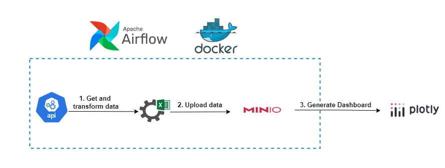

# Top Crypto Exchanges Project

## Introduction
The "Top Crypto Exchanges Project" is designed to automate the collection and transformation of data from cryptocurrency exchange APIs. Utilizing Docker for containerization, Airflow for workflow orchestration, and MinIO for scalable storage, the project streamlines data management and integration. Dash and Plotly are employed to build interactive dashboards that provide up-to-date insights from daily data updates.

## Technologies Used
1. Programming Language - Python    
2. Data Storage - MinIO (S3-compatible)
3. Workflow Management - Apache Airflow
4. Data Visualization - Dash, Plotly
5. Container Platform - Docker

## Architecture

DAG Tasks:
1. Scrape data from [APIs](https://api.coincap.io/v2/exchanges).
2. Transform and load data to [S3(MinIO)](https://min.io/docs/minio/container/index.html).

## Dashboard

## Run The Project
1. Make sure Docker is installed (required to run the project).
2. Prepare environment for MinIO:
    - In the `minio` directory, rename the `.env.example` file to `.env`.
    - Set the values for environment variables in that file
3. Run MinIO:
    - In the `minio` directory, run the command: `docker compose up`.
    - After MinIO is up and running, create a new bucket and generate access and secret keys.
4. Prepare Airflow Environment:
    - In the `airflow_s3_dash` directory, rename the `.env.example` file to `.env`.
    - Set the values for environment variables in that file
5. Run Airflow:
    - In the `airflow_s3_dash` directory, run the command: `docker compose up`.
6. Connect Networks:
    - Connect the `airflow_s3_dash` container to the network of the `minio` container by running the command: `docker network connect {network name of minio} {container name of airflow_s3_dash}`. 
    - To list all networks, run the command: `docker network ls`.
7. Access the UIs:
    - Open the Airflow UI in your browser at: `http://localhost:8080`.
    - Open the MinIO UI in your browser at: `http://localhost:9001`.
    - Open the Dashboard in your browser at: `http://localhost:8050`.

## Links For Airflow Documentation
- https://medium.com/datareply/airflow-lesser-known-tips-tricks-and-best-practises-cf4d4a90f8f  
- https://medium.com/handy-tech/airflow-tips-tricks-and-pitfalls-9ba53fba14eb  
- https://www.astronomer.io/guides/dag-best-practices/  
   
